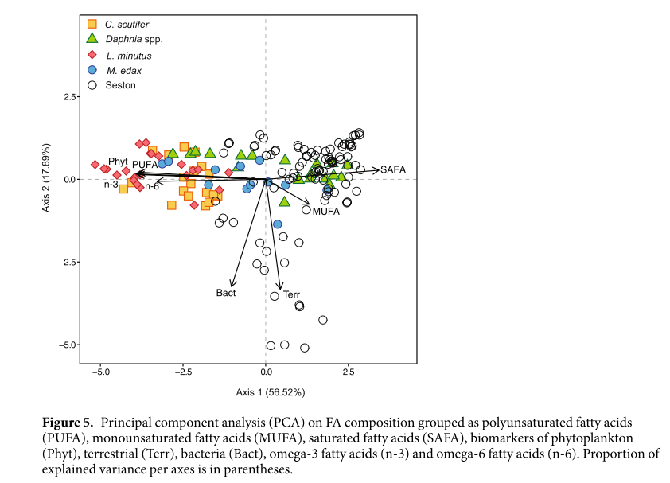

### Goal

I'm trying to reproduce the graph published in: 

*Grosbois, G., Mariash, H., Schneider, T., & Rautio, M. (2017). Under-ice availability of phytoplankton lipids is key to freshwater zooplankton winter survival. Scientific reports, 7(1), 1-11.*

The pdf as well as the suplementary data are included in this github repository.
Here is the figure of the PCA of Grosbois et al. that I'm trying to reproduce.

#

### First try on the raw data

I have grouped the data in excel (SAFA, MUFA, PUFA, n-3,n-6 and the biomarkers for phytoplankton, bacteria, terrestrial) as indicated in their paper.
```{r}
library(readxl)
library(factoextra)
library(tidyverse)

group <- read_excel("C:/Users/Erwin kers/OneDrive/UIT/BIO-3524/practice data/Github/Multivariate-FA-stats/grouping.xlsx")
View(group)

groupPR <- prcomp(group[c(44:51)], center = T, scale = T)
fviz_pca_biplot(groupPR, geom.ind = "point", pointshape = 21, 
             pointsize = 2, 
             fill.ind = group$Species, 
             col.ind = "black", 
             palette = "jco", 
             addEllipses = TRUE,
             label = "var",
             col.var = "black",
             repel = TRUE,
             legend.title = "Species") +
  ggtitle("2D PCA-plot from FA dataset") +
  theme(plot.title = element_text(hjust = 0.5))
```
As you can see I did not get the same results as they did in the paper, Amanda already mentioned I should use percentage FA.

***

### Here I worked with the FA percentages 

Here I used the data but than as a percentage of total FA.(calculated this and made a new excel file)
**Note** I have changed the colors to match their colors for easier comparison

```{r, error= T, warning= T}
######## Percentage----

percent <- read_excel("C:/Users/Erwin Kers/OneDrive/UIT/BIO-3524/practice data/Github/Multivariate-FA-stats/percentage FA.xlsx")

## not the same result, did they remove outliers?

percentPR <- prcomp(percent[c(44:51)], center = T, scale = T)
fviz_pca_biplot(percentPR, geom.ind = "point",
                
                pointshape = 22, 
                pointsize = 2, 
                fill.ind = percent$Species, 
                col.ind = "black", 
                palette = c("yellow", "green","red", "blue", "white"), 
                addEllipses = F,
                label = "var",
                col.var = "black",
                repel = F,
                legend.title = "Species") +
  ggtitle("2D PCA-plot from FA dataset") +
  theme(plot.title = element_text(hjust = 0.5))
```

### Tried to normalize the data
They mentioned they normalized their data but I don't know how, maybe they just meant as % of total FA?

```{r}
# trying to get the same layout (PCA)
library(FactoMineR)
library(ade4)
library(ExPosition)

#trying to normalize the date (they mentioned they did)

#define Min-Max normalization function
min_max_norm <- function(x) {
  (x - min(x)) / (max(x) - min(x))
}

#apply Min-Max normalization
normFA <- as.data.frame(lapply(percent[c(44:51)], min_max_norm))

Normok <- prcomp(normFA, center = T, scale = F)
fviz_pca_biplot(Normok, geom.ind = "point", pointshape = 21, 
                pointsize = 2, 
                fill.ind = group$Species, 
                col.ind = "black", 
                palette = "jco", 
                addEllipses = T,
                label = "var",
                col.var = "black",
                repel = T,
                legend.title = "Species") +
  ggtitle("2D PCA-plot from FA dataset") +
  theme(plot.title = element_text(hjust = 0.5))
```


### NMDS with the same percentage data

I thought this might look more like their plot, but this is very different.

```{r}
#### NMDS
library(ggplot2)

q <- metaMDS(percent[c(49:51)], distance="bray", k=2, trymax=35, autotransform=TRUE)
stressplot(q)

NMDS1 <- q$points[,1] 
NMDS2 <- q$points[,2]
NMDS.plot<-cbind(percent, NMDS1, NMDS2)

ggplot(NMDS.plot, aes(NMDS1, NMDS2, color=Species))+
  geom_point(position=position_jitter(.1), shape=3)+##separates overlapping points
  stat_ellipse(type='t',size =1)+ ##draws 95% confidence interval ellipses
  theme_minimal()
```


### Correspondence analysis
```{r}
plot(CA(percent[c(44:51)]))
```

***

### PERMANOVA

In the paper they performed a PERMANOVA to see the differences in FA composition between taxa.

```{r, results = "asis"}
########## PERMANOVA
library(vegan)

PERM <- adonis2(percent[c(44:49)] ~ Species, data = percent, permutations = 999, method="bray")

#somehow everything i test is significant. Can't get the same results as the paper:
  #PERMANOVA, F(4,122) = 93.2, p = 0.001)
library(knitr)
kable(PERM)
``` 


